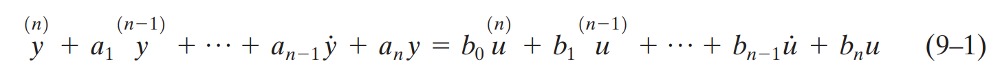
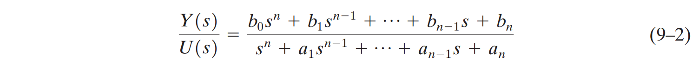

<br>

## 전달함수의 Canonical Forms(표준 형태)

전달함수는  기본적으로 다음과 같은 시간영역(Time Domain) 상에서 표현된 System 을 Laplace Transform 을 통해 변환하여 주파수영역(Frequency Domain) 으로 표현할 수 있다. 





이때 이러한 기본형 TF 함수를 기반으로 하여 다양한 시스템을 구성할 수 있는데 이를 State-Space Form(상태공간) 형식으로 나타낼 수 있고, 

이번글에서는 

- controllable canonical form

- observable canonical form

- diagonal (or Jordan) canonical form. 

총 네가지 기능을 가진 SS 에 대해 알아본다.


## 입력

첫째 줄에 준하가 가입하려고 하는 사이트에 이미 존재하는 아이디가 주어진다. 아이디는 알파벳 소문자로만 이루어져 있으며, 길이는 50자를 넘지 않는다.

## 출력

첫째 줄에 준하의 놀람을 출력한다. 놀람은 아이디 뒤에 ??!를 붙여서 나타낸다.

## 내 제출

```python
print(input() + "??!")
```

## 결과

정답

## 사용된 코드 이론

파이썬에서 문자열을 만드는 방법은 총 4가지이다.

**1. 큰따옴표(`"`)로 양쪽 둘러싸기**

```python
"Hello World"
```

**2. 작은따옴표(`'`)로 양쪽 둘러싸기**

```python
'Python is fun'
```

**3. 큰따옴표 3개를 연속(`"""`)으로 써서 양쪽 둘러싸기**

```python
"""Life is too short, You need python"""
```

**4. 작은따옴표 3개를 연속(`'''`)으로 써서 양쪽 둘러싸기**

```python
'''Life is too short, You need python'''
```

### 여러 줄인 문자열을 변수에 대입하고 싶을 때

파이썬에서는 다음과 같이 작은따옴표 3개(''') 또는 큰따옴표 3개(""")를 사용한다.

```python
>>> multiline='''
... Life is too short
... You need python
... '''
```

*작은따옴표 3개를 사용한 경우*

```python
>>> multiline="""
... Life is too short
... You need python
... """
```

*큰따옴표 3개를 사용한 경우*

print(multiline)을 입력해서 어떻게 출력되는지 확인해 보자.

```python
>>> print(multiline)
Life is too short
You need python
```

두 경우 모두 결과는 동일하다. 위 예에서도 확인할 수 있듯이 문자열이 여러 줄인 경우 이스케이프 코드를 쓰는 것보다 따옴표를 연속해서 쓰는 것이 훨씬 깔끔하다.

## 문자열 연산하기

파이썬에서는 문자열을 더하거나 곱할 수 있다. 다른 언어에서는 쉽게 찾아볼 수 없는 재미있는 기능으로, 우리 생각을 그대로 반영해 주는 파이썬만의 장점이라고 할 수 있다. 문자열을 더하거나 곱하는 방법에 대해 알아보자.

### 문자열 더해서 연결하기(Concatenation)

```python
>>> head = "Python"
>>> tail = " is fun!"
>>> head + tail
'Python is fun!'
```

위 소스 코드에서 세 번째 줄을 보자. 복잡하게 생각하지 말고 눈에 보이는 대로 생각해 보자. "Python"이라는 head 변수와 " is fun!"이라는 tail 변수를 더한 것이다. 결과는 'Python is fun!'이다. 즉 head와 tail 변수가 +에 의해 합쳐진 것이다.

직접 실행해 보고 결괏값이 제시한 것과 똑같이 나오는지 확인해 보자.

### 문자열 곱하기

```python
>>> a = "python"
>>> a * 2
'pythonpython'
```

위 소스 코드에서 `*`의 의미는 우리가 일반적으로 사용하는 숫자 곱하기의 의미와는 다르다. 위 소스 코드에서 `a * 2` 문장은 a를 두 번 반복하라는 뜻이다. 즉 `*`는 문자열의 반복을 뜻하는 의미로 사용되었다. 굳이 코드의 의미를 설명할 필요가 없을 정도로 직관적이다.

### 문자열 곱하기 응용

문자열 곱하기를 좀 더 응용해 보자. 다음 소스를 IDLE 에디터를 열고 작성해 보자.

```python
# multistring.py

print("=" * 50)
print("My Program")
print("=" * 50)
```

입력한 소스는 `C:\doit` 디렉터리에 파일 이름 multistring.py로 저장하자.

이제 프로그램을 실행해 보자. [`윈도우 + R`(실행) → cmd 입력 → `Enter`]를 눌러 명령 프롬프트 창을 열고 다음을 따라 해 보자. 결괏값이 다음과 같이 나타날 것이다.

```no-highlight
C:\Users>cd C:\doit
C:\doit>python multistring.py
==================================================
My Program
==================================================
```

이런 식의 표현은 앞으로 자주 사용하게 될 것이다. 프로그램을 만들어 실행시켰을 때 출력되는 화면 제일 위쪽에 프로그램 제목을 이와 같이 표시하면 보기 좋지 않겠는가?

---

---

## 참고문헌

[02-2 문자열 자료형 - 점프 투 파이썬](https://wikidocs.net/13)

[[Python] 파이썬 나눗셈 나머지, 몫 구하기 ( / , %, // , divmod) — 개발하는 사막여우](https://dev-note-97.tistory.com/65)
