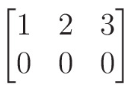
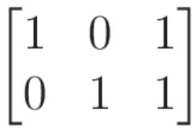

 

## 전달함수의 Canonical Forms(표준 형태)

전달함수는  기본적으로 다음과 같은 시간영역(Time Domain) 상에서 표현된 System 을 Laplace Transform 을 통해 변환하여 주파수영역(Frequency Domain) 으로 표현할 수 있다. 

이때 이러한 기본형 TF 함수를 기반으로 하여 다양한 시스템을 구성할 수 있는데 이를 State-Space Form(상태공간) 형식으로 나타낼 수 있고, 

이번글에서는 

- controllable canonical form

- observable canonical form

- diagonal canonical form. 

- Jordan canonical form.

총 네가지 기능을 가진 SS 에 대해 알아보자.

 

## 행렬의 Rank

[Rank] : 행렬이 가지는 independent 한 column 의 수

               = Column space 의 dimension( = Row space 의 dimenstion)

 

**independent 한 column 의 수** = **independent 한 row 의 수**

즉

rank(A) = rank(AT) 

가 성립하며 이를 통해 Column space 의 dimension= Row space 의 dimenstion 임을 알 수 있다.

본 행렬의 경우에는 첫번째 컬럼만이 independent 하기 때문에 Rank = 1 이고,

다음의 경우에는 첫번째, 두번째 column 이 independent 하므로 Rank = 2 이다.

또한 해당 Matrix 의 row 와 column 의 수와 independent 한 row column 의 수를 비교하여 각각

Rank Deficient

Full Rank (Full row Rank, Full column Rank) 로 분류한다.

본 행렬의 경우 2x3 행렬이지만 Rank = 1 이므로 Rank-deficient 인 행렬이고

본 행렬은 2x3 행렬, Rank = 2 로 Full row rank 이다.

  , Rank = 1             ,  Rank = 2

## controllable canonical form

해당 SS 모델은 

---

---

## 참고문헌

[[고등자동제어] State space와 transfer function의 관계](https://normal-engineer.tistory.com/25)

[[선대] 2-9강. rank (행렬의 계수) - YouTube](https://www.youtube.com/watch?v=HMST0Yc7EXE)

Katsuhiko Ogata _ Modern Control Engineering 5th Edition chapter 9
