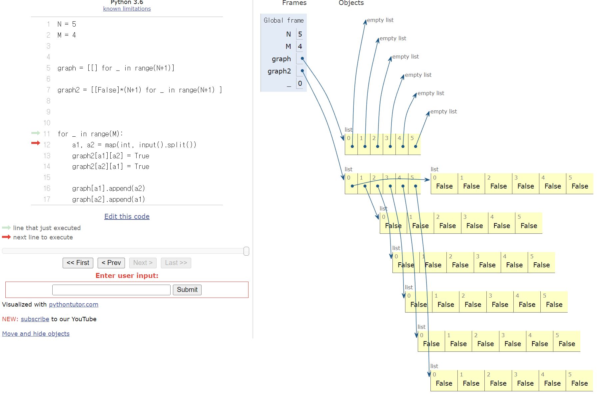
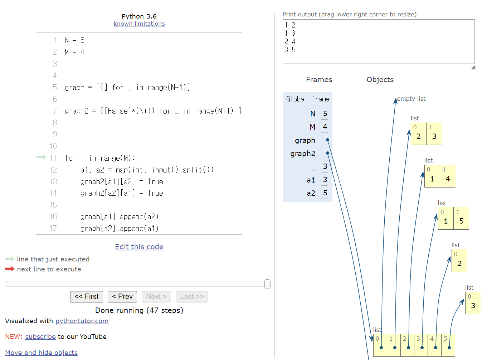
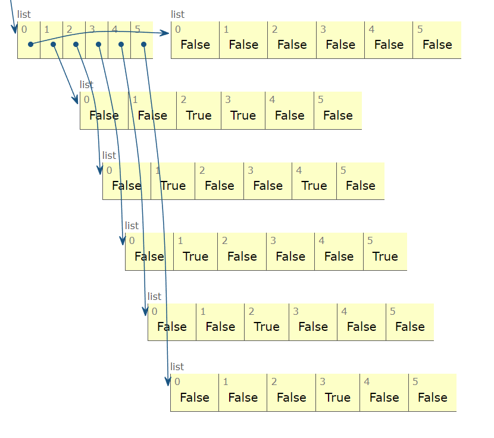
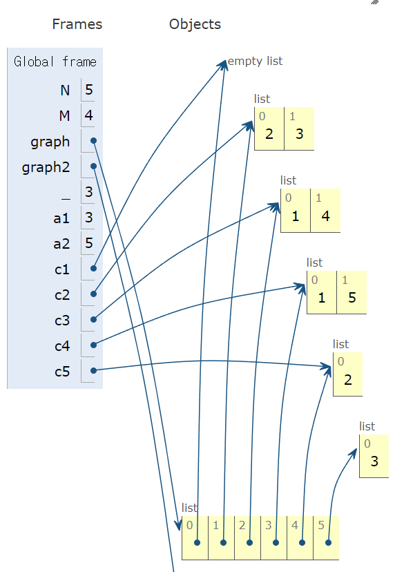

<br>

| 단계  | 제목      | 설명       |        |
| --- | ------- | -------- | ------ |
|     | **소단계** | **문제번호** | **제목** |
|     |         | 2644     | 촌수계산   |

## 문제

우리 나라는 가족 혹은 친척들 사이의 관계를 촌수라는 단위로 표현하는 독특한 문화를 가지고 있다. 이러한 촌수는 다음과 같은 방식으로 계산된다. 기본적으로 부모와 자식 사이를 1촌으로 정의하고 이로부터 사람들 간의 촌수를 계산한다. 예를 들면 나와 아버지, 아버지와 할아버지는 각각 1촌으로 나와 할아버지는 2촌이 되고, 아버지 형제들과 할아버지는 1촌, 나와 아버지 형제들과는 3촌이 된다.

여러 사람들에 대한 부모 자식들 간의 관계가 주어졌을 때, 주어진 두 사람의 촌수를 계산하는 프로그램을 작성하시오.

## 입력

사람들은 1, 2, 3, …, n (1 ≤ n ≤ 100)의 연속된 번호로 각각 표시된다. 입력 파일의 첫째 줄에는 전체 사람의 수 n이 주어지고, 둘째 줄에는 촌수를 계산해야 하는 서로 다른 두 사람의 번호가 주어진다. 그리고 셋째 줄에는 부모 자식들 간의 관계의 개수 m이 주어진다. 넷째 줄부터는 부모 자식간의 관계를 나타내는 두 번호 x,y가 각 줄에 나온다. 이때 앞에 나오는 번호 x는 뒤에 나오는 정수 y의 부모 번호를 나타낸다.

각 사람의 부모는 최대 한 명만 주어진다.

## 출력

입력에서 요구한 두 사람의 촌수를 나타내는 정수를 출력한다. 어떤 경우에는 두 사람의 친척 관계가 전혀 없어 촌수를 계산할 수 없을 때가 있다. 이때에는 -1을 출력해야 한다.

## 내 제출

###### dfs 사용

```python
N = int(input()) #전체사람
a, b = map(int, input().split())
M = int(input())
result = []

visited = [False]*(N+1)
graph = [[False]*(N+1) for _ in range(N+1) ]


for _ in range(M):
    a1, a2 = map(int, input().split())
    graph[a1][a2] = True
    graph[a2][a1] = True

V = a

def dfs(V,count):
    visited[V] = True
    for i in range(N+1):
        count += 1
        if i == b:
            result.append(count)
            break
        elif not visited[i] and graph[V][i]:
            dfs(i,count)

            return count

dfs(V,0)
if len(result) == 0:
    print(-1)
else:
    print(result[0]-1)
```

###### bfs 사용

```python

```

## 결과

오답. 틀렸습니다.

## 수정 제출

```python
# 입력값 받는 부분
N = int(input())
A, B = map(int, input().split())
M = int(input())
graph = [[] for _ in range(N+1)]
visited = [False] * (N+1)
result = []
####

# 어떤 노드들이 연결되어 있는지 graph라는 2차원 배열에 저장
for _ in range(M):
  x, y = map(int, input().split())  
  graph[x].append(y)
  graph[y].append(x)

# dfs
def dfs(v, num):
  num += 1
  visited[v] = True

  if v == B:
    result.append(num)

  for i in graph[v]:
    if not visited[i]:
      dfs(i, num)

dfs(A, 0)
if len(result) == 0:
  print(-1)
else:
  print(result[0]-1)
```

## 결과

정답

## 오답이유

정답코드와 차이인 부분

##### 노드 연결여부 확인 부분

###### 오답코드

```python
for _ in range(M):
    a1, a2 = map(int, input().split())
    graph[a1][a2] = True
    graph[a2][a1] = True
```

###### 정답코드

```python
# 어떤 노드들이 연결되어 있는지 graph라는 2차원 배열에 저장
for _ in range(M):
  x, y = map(int, input().split())  
  graph[x].append(y)
  graph[y].append(x)
```

내가 만든 코드 부분에서는 노드의 연결여부를 확인하는 graph를 [False] 요소가 N+1 개의 정사각 배열에 포함되어있는 구조로 선언해주었으나

정답인 코드의 부분에는 그렇지 않다. 이는 도식화 하면 다음과 같다.



각부분의 연결여부 코드를 집어넣으면 다음과 같은 결과가 나온다.

###### 정답코드



###### 내 코드



##### dfs 함수 부분

###### 오답코드

```python
def dfs(V,count):
    visited[V] = True
    for i in range(N+1):
        count += 1
        if i == b:
            result.append(count)
            break
        elif not visited[i] and graph[V][i]:
            dfs(i,count)

            return count
```

###### 정답코드

```python
def dfs(v, num):
  num += 1
  visited[v] = True

  if v == B:
    result.append(num)

  for i in graph[v]:
    if not visited[i]:
      dfs(i, num)
```

graph 의 List 요소에 각각 요소(node) 에 연결된 node 의 number 만 할당해 주어서 해당 List 에 저장된 list 를 for 문을 돌려주면서 방문여부를 체크한다.

즉 예시로 V = 2의 경우 graph 의 list 요소중 두번째 list 를 불러와



**graph[2] = [1,4]**

해당 list 의 요소 값으로 for 문을 돌린다.


###### 수정코드

```python
N = int(input()) #전체사람
a, b = map(int, input().split())
M = int(input())
result = []

visited = [False]*(N+1)
graph = [[False]*(N+1) for _ in range(N+1) ]


for _ in range(M):
    a1, a2 = map(int, input().split())
    graph[a1][a2] = True
    graph[a2][a1] = True
    
V = a
    
def dfs(V,count):
    count += 1
    visited[V] = True
    
    if V == b:
        result.append(count)
    for i in range(N+1):
        if not visited[i] and graph[V][i]:
            dfs(i,count)
            
dfs(V,0)
if len(result) == 0:
    print(-1)
else:
    print(result[0]-1)
```

###### 주의점

수정코드에서 주목할 점 중 하나는 dfs 함수 선언 내부의 count 역할을 하는 V == b 부분의 if 와 for 의 계층이 같다는 것이다.

```python
def dfs(V,count):
    count += 1
    visited[V] = True
    
    if V == b:
        result.append(count)
    for i in range(N+1):
        if not visited[i] and graph[V][i]:
            dfs(i,count)
```

즉 해당코드는 탐색을 끝까지 할 수 는 있지만, 그중에 탐색하고있는 node 가 종착지에 도달하는 경우에만 count 를 수행하고 이를 result 로 append 하는것으로,

b 에 도달하고나서 추가적으로 탐색을 할수있을지 없을지는 미지수이지만, count 는 b 까지만 수행하겠다는 의미이다.

###### 결과 출력

```python
def dfs(V,count):
    count += 1
    visited[V] = True
    
    if V == b:
        result.append(count)
    for i in range(N+1):
        if not visited[i] and graph[V][i]:
            dfs(i,count)
            
dfs(V,0)
if len(result) == 0:
    print(-1)
else:
    print(result[0]-1)
```


마지막의 출력부분에서 result[0] 인 이유는 count 한 결과값을 계속 result 에 누적 저장한 것이 아니라, count 를 늘려주다가 V == b 조건에서 저장해준 것이기 때문에 첫번째 값인 result[0]  을 출력해주고, 촌수에서 나는 포함이 안되므로 -1 해준다.

## 코드 해석


---

---

## 참고문헌
